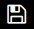
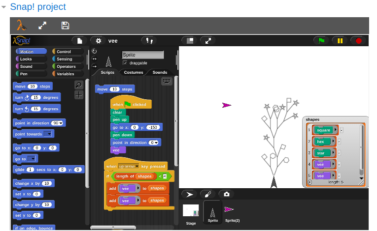
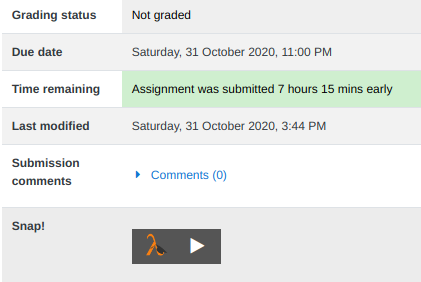
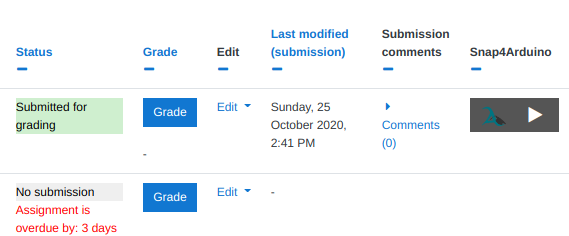
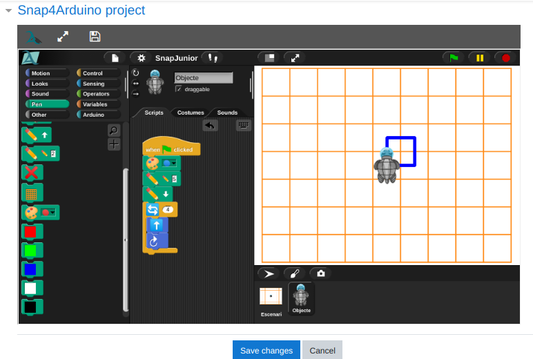
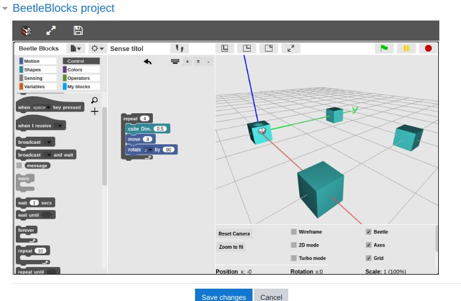
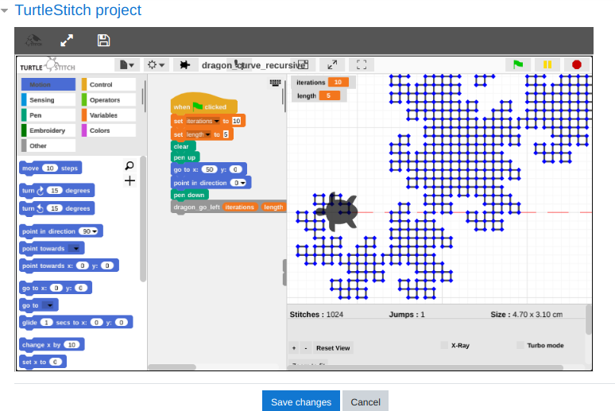

# Snap! Moodle plugins 

## This repo has all the info about Snap! Moodle plugins (developed in other repos) and it keeps the maintenance of the legacy plugins (to use Snap! old versions and some Snap! flavours).

## Add to your Moodle activities the ability to include Snap! projects
- You can include **Snap!**, **Snap4Arduino**, **Beetleblocks**, **TurtleStitch** or your own Snap! customization
- **Everything runs in your Moodle server** (users, projects...and even your Snap! distro)
- It is **a Moodle assignment submission plugin**, adding this feature to any of your assignment activities.

- Available with English, Spanish and Catalan translations.

## Download and play!
-   **Snap! submissions 1.1** _(Snap! 6.7.1)_ Download [here](https://github.com/jguille2/SnapInMoodle/releases/download/v1.1/snap.zip) or in [Moodle Plugins site](https://moodle.org/plugins/assignsubmission_snap) 
-   **Snap4Arduino submissions 1.1** _(SnapArduino 6.7.1)_ Download [here](https://github.com/jguille2/SnapInMoodle/releases/download/v1.1/snap4arduino.zip) or in [Moodle Plugins site](https://moodle.org/plugins/assignsubmission_snap4arduino)
-   **BeetleBlocks submissions 1.1** _(BeetleBlocks 5.3.2)_ Download [here](https://github.com/jguille2/SnapInMoodle/releases/download/v1.1/beetleblocks.zip) or in [Moodle Plugins site](https://moodle.org/plugins/assignsubmission_beetleblocks)
-   **TurtleStitch submissions 1.1** _(TurtleStitch 2.6.1)_ Download [here](https://github.com/jguille2/SnapInMoodle/releases/download/v1.1/turtlestitch.zip) or in [Moodle Plugins site](https://moodle.org/plugins/assignsubmission_turtlestitch) 

## Documentation

[Students](#students) - [Teachers](#teachers) - [MoodleAdmins](#admins) - [Developers](#developers)

[ScreenShots](#screenshots)

## Students

Your submission will work as in **a usual assignment**, but **with a Snap! project inside**, which **you can edit and submit** like any other element of the activity.
- The **starting point** can be an **empty project or a template** chosen by the teacher. In any case, you can edit it (and also start an empty project) freely. If you want to return to the initial template, you must delete your submission and start again.

- **To save a submission**, you can use the **submit button of the assignment form or you can use the    button** with the floppy disk icon of the Snap*!* tool bar.
- We recommend working in **full screen**, to have the editor optimized. With a single click you can toggle your view (to full screen    or out of full screen   ).

- The submission view is a button. Click to load and see your project.

- **In the submission view** (not editing), the Snap project! it's fully editable ... but remember **you can't save it to Moodle**. You have the "Read-Only mode" warning.
- In the embedded project you have all the Snap*!* features and so, **you can export** projects, sprites, blocks... and save your work in your computer. So, you can save the work made in a "Read-only mode" space in you computer. **And you also can upload** these Snap*!* elements so, you can upload to Moodle projects from outsite.

## Teachers

With this plugin you can add Snap*!* projects to your assignments.

- You only have to mark the **Snap*!* checkbox** in your assignment *submission type* area to request a Snap*!* submission.  
- You can upload a **template** (a *starting point* project) to the **Additional files** assignment area.
  - You can add other files (pictures, docs...) and other Snap*!* elements (sprites, blocks...) as part of the activity information.
  - You can also add more than one project. Moodle uses the last uploaded project as a template.
  - If you want to add different projects (as information) but you don't want a template, you can upload an "empty project" at the end (the latest project upload).
- Notes for Snap4Arduino, BeetleBlocks, TurtleStitch...
  - If your moodle has these plugins, you can add different submission types in the same assignment.
  - To use templates, be sure the project file is stored using the right environment. For exemple, a Snap4Arduino project only will be loaded as a Snap4Arduino template. To be sure, you can use your Moodle embedded environments to export those files.

## Admins

- This is an **assignment submission plugin**. To install it, upload the `snap` folder into your `path/to/Moodle/mod/assign/submission/`. That's all!
- It doesn't use any *cloud features*. Your data is stored in your Moodle servers.
- You only need to choose if assignments will have these submissions by default. By default, it's not.
- Aslo, the Snap*!* distro is in your server. The plugin settings has the info of the URL of your Snap*!* (`path/to/your/Moodle/mod/assign/submission/snap/run/`). You can use it freely, without any Moodle login, as your Snap*!* school distro. Cloud features are not available (see [developers](#Developers] section for more info).
- You can install different *snaps* plugins (Snap*!*, Snap4Arduino, BeetleBlocks, TurtleStitch... and also your Snap! distro - see [developers](#Developers) info-) to your Moodle. Then, your Moodle assignments may have more than one submissions enabled.

## Developers

Do you want to build your own Snap! plugin? It's easy!
- Add your `/source/pluginName/` folder with your Snap! editor (your distro) inside.
- Go to `/assets/` and add your "png file" (use `pluginNameMoodle.png` as name) for your plugin icon picture.
- Check `/build` script and add your "case". You only have to write 4 strings: **pluginName** (is your "source folder" - use lowercase without spaces), **pluginApp** (the real name), **pluginVersion** and **pluginTableName** (the table name in Moodle). The four initial examples (Snap!, Snap4Arduino...) show you this clearly.
- That's all! The **Build** script (`./build --pluginName`) will build your plugin.

Cloud features are not available in your Snap*!* embedded and they are not running in your installed distro (`path/to/your/Moodle/mod/assign/submission/snap/run/`). But you can install your *own Snap*!* cloud* or you can have access to another Snap*!* cloud.

## ScreenShots
### Working with Snap*!* projects

### Submission summary with a Snap*!* project

### Grading assignments with a Snap4Arduino submission

### Working with Snap4Arduino projects

### Submission summary with 3 different projects

### Working with a BeetleBlocks project

### Working with a TurtleStitch project

